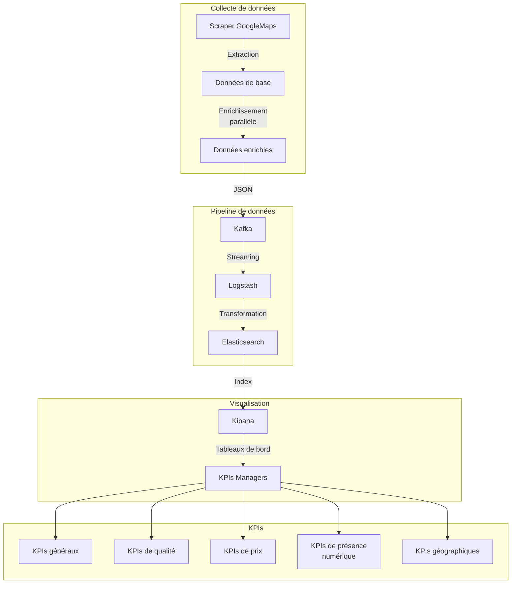

# Pipeline de données ELK avec Kafka

Ce projet met en place une pipeline de données complète utilisant :
- Un scraper pour collecter des données
- Kafka pour le streaming des données
- Logstash pour la transformation
- Elasticsearch pour le stockage
- Kibana pour la visualisation

## Architecture

Architecture simplifiée :
```
Scraper -> Kafka -> Logstash -> Elasticsearch -> Kibana
               |
               v
         Kafka Connect
               |
               v
         Elasticsearch
```

Architecture détaillée avec flux de données et KPIs :


## Prérequis

- Docker et Docker Compose
- Bash

## Installation et démarrage

1. Clonez ce dépôt
2. Exécutez le script de démarrage :

```bash
./start-pipeline.sh
```

Ce script va :
- Démarrer tous les services avec Docker Compose
- Configurer Kafka Connect pour envoyer les données à Elasticsearch
- Afficher les URLs des interfaces disponibles

## Accès aux interfaces

- **Kibana**: http://localhost:5601
- **Elasticsearch**: http://localhost:9200
- **Kafka Connect**: http://localhost:8083

## Topics Kafka et Index Elasticsearch

### Topics Kafka
- **scraper-data** : Données collectées par le scraper
- **kafka-connect-configs** : Configurations de Kafka Connect
- **kafka-connect-offsets** : Offsets de Kafka Connect
- **kafka-connect-status** : Statut de Kafka Connect

### Index Elasticsearch
- **business-*** : Index principal contenant les données collectées (format: business-YYYY.MM.DD)

## Structure du projet

- `scraper/` : Code source du scraper
  - `core/` : Logique principale du scraper
  - `scrapers/` : Modules de scraping spécifiques
  - `utils/` : Utilitaires (parsers, senders)
  - `config/` : Fichiers de configuration
- `logstash/` : Configuration de Logstash
  - `config/` : Configuration générale
  - `pipeline/` : Configuration des pipelines
- `docker-compose.yml` : Configuration des services Docker
- `setup-kafka-connect.sh` : Script de configuration de Kafka Connect
- `start-pipeline.sh` : Script de démarrage de la pipeline

## Fonctionnalités du scraper

Le scraper a été optimisé avec les fonctionnalités suivantes :

1. **Scraping en deux étapes** :
   - Extraction des données de base depuis Google Maps
   - Enrichissement avec des informations complémentaires (téléphone, site web, réseaux sociaux)

2. **Traitement parallèle** :
   - Utilisation de threads pour accélérer l'enrichissement des données
   - Paramètres configurables via les options de ligne de commande

3. **Options de ligne de commande** :
   ```bash
   python -m scraper.test --parallel --workers 5 --ville Casablanca
   ```
   - `--parallel` : Active le traitement parallèle
   - `--workers N` : Définit le nombre de threads (par défaut: 5)
   - `--ville NOM` : Limite le scraping à une ville spécifique
   - `--scraper NOM` : Spécifie le scraper à utiliser (par défaut: googlemaps)

## Transformations Logstash

Les données collectées sont enrichies par Logstash avec les transformations suivantes :

1. **Géolocalisation** : Conversion des coordonnées en format geo_point pour Elasticsearch
2. **Normalisation des numéros de téléphone** : Format standardisé pour l'affichage
3. **Catégorisation des réseaux sociaux** : Extraction par plateforme (Facebook, Instagram, etc.)
4. **Classification des notes** : Catégories de qualité basées sur les notes
5. **Analyse de popularité** : Classification basée sur le nombre d'avis
6. **Catégorisation des prix** : Niveaux de prix basés sur la fourchette de prix
7. **Analyse des sites web** : Extraction de domaine, sécurité (HTTPS), type de site

## KPIs et tableaux de bord pour managers

Les tableaux de bord Kibana permettent aux managers de suivre les KPIs suivants :

### KPIs généraux

1. **Nombre total de restaurants** par ville
2. **Répartition des restaurants** par catégorie de cuisine
3. **Note moyenne** des restaurants par ville et quartier
4. **Taux de présence en ligne** (% de restaurants avec site web)
5. **Taux de présence sur les réseaux sociaux** (% par plateforme)

### KPIs de qualité

6. **Top 10 des restaurants** par note et nombre d'avis
7. **Distribution des notes** par catégorie de prix
8. **Évolution des notes** dans le temps (si données historiques disponibles)
9. **Restaurants à forte progression** (augmentation du nombre d'avis)

### KPIs de prix et popularité

10. **Répartition des restaurants** par catégorie de prix
11. **Prix moyen** par quartier et type de cuisine
12. **Corrélation entre prix et note** (graphique à dispersion)
13. **Restaurants les plus populaires** par nombre d'avis

### KPIs de présence numérique

14. **Taux d'équipement en site web sécurisé** (HTTPS)
15. **Répartition par type de site web** (domaine personnalisé vs plateforme)
16. **Présence multi-réseaux** (nombre de plateformes sociales par restaurant)
17. **Top 10 des restaurants** par présence numérique complète

### KPIs géographiques

18. **Carte de densité** des restaurants par quartier
19. **Clusters géographiques** par type de cuisine
20. **Zones à fort potentiel** (faible densité de restaurants de qualité)

## Visualisations recommandées

1. **Carte de chaleur** montrant la densité des restaurants
2. **Graphiques circulaires** pour la répartition par cuisine et niveau de prix
3. **Histogrammes** pour la distribution des notes
4. **Tableaux de classement** pour les meilleurs restaurants
5. **Métriques** pour les KPIs principaux
6. **Nuages de mots** pour les types de cuisine populaires

## Résolution des problèmes TLS

La configuration actuelle désactive la sécurité TLS entre Elasticsearch et Kibana pour éviter les problèmes courants. Si vous souhaitez activer la sécurité en production, modifiez les paramètres suivants :

1. Dans `docker-compose.yml`, pour Elasticsearch :
   ```yaml
   environment:
     - xpack.security.enabled=true
     - xpack.security.transport.ssl.enabled=true
   ```

2. Générez des certificats et configurez-les correctement pour Elasticsearch et Kibana.

## Arrêt des services

Pour arrêter tous les services :

```bash
docker-compose down
```

Pour supprimer également les volumes (attention, cela effacera toutes les données) :

```bash
docker-compose down -v
``` 


flowchart TB
    subgraph "Collecte de données"
        A[Scraper GoogleMaps] -->|Extraction| B[Données de base]
        B -->|Enrichissement<br/>parallèle| C[Données enrichies]
    end
    
    subgraph "Pipeline de données"
        C -->|JSON| D[Kafka]
        D -->|Streaming| E[Logstash]
        E -->|Transformation| F[Elasticsearch]
    end
    
    subgraph "Visualisation"
        F -->|Index| G[Kibana]
        G -->|Tableaux de bord| H[KPIs Managers]
    end
    
    subgraph "KPIs"
        H --> KPI1[KPIs généraux]
        H --> KPI2[KPIs de qualité]
        H --> KPI3[KPIs de prix]
        H --> KPI4[KPIs de présence<br/>numérique]
        H --> KPI5[KPIs géographiques]
    end