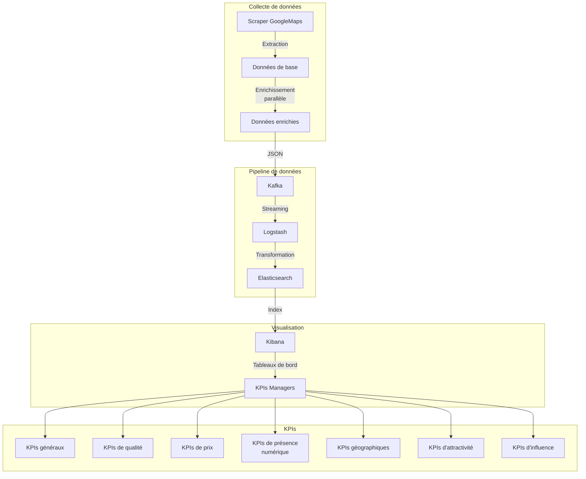

# Pipeline de données ELK avec Kafka

Ce projet met en place une pipeline de données complète utilisant :
- Un scraper pour collecter des données
- Kafka pour le streaming des données
- Logstash pour la transformation
- Elasticsearch pour le stockage
- Kibana pour la visualisation

## Architecture

Architecture simplifiée :
```
Scraper -> Kafka -> Logstash -> Elasticsearch -> Kibana
               |
               v
         Kafka Connect
               |
               v
         Elasticsearch
```

Architecture détaillée avec flux de données et KPIs :


## Prérequis

- Docker et Docker Compose
- Bash

## Installation et démarrage

1. Clonez ce dépôt
2. Exécutez le script de démarrage :

```bash
./start-pipeline.sh
```

Ce script va :
- Démarrer tous les services avec Docker Compose
- Configurer Kafka Connect pour envoyer les données à Elasticsearch
- Afficher les URLs des interfaces disponibles

## Accès aux interfaces

- **Kibana**: http://localhost:5601
- **Elasticsearch**: http://localhost:9200
- **Kafka Connect**: http://localhost:8083

## Topics Kafka et Index Elasticsearch

### Topics Kafka
- **scraper-data** : Données collectées par le scraper
- **kafka-connect-configs** : Configurations de Kafka Connect
- **kafka-connect-offsets** : Offsets de Kafka Connect
- **kafka-connect-status** : Statut de Kafka Connect

### Index Elasticsearch
- **business-*** : Index principal contenant les données collectées (format: business-YYYY.MM.DD)

## Structure du projet

- `scraper/` : Code source du scraper
  - `core/` : Logique principale du scraper
  - `scrapers/` : Modules de scraping spécifiques
  - `utils/` : Utilitaires (parsers, senders)
  - `config/` : Fichiers de configuration
- `logstash/` : Configuration de Logstash
  - `config/` : Configuration générale
  - `pipeline/` : Configuration des pipelines
- `docker-compose.yml` : Configuration des services Docker
- `setup-kafka-connect.sh` : Script de configuration de Kafka Connect
- `start-pipeline.sh` : Script de démarrage de la pipeline

## Fonctionnalités du scraper

Le scraper a été optimisé avec les fonctionnalités suivantes :

1. **Scraping en deux étapes** :
   - Extraction des données de base depuis Google Maps
   - Enrichissement avec des informations complémentaires (téléphone, site web, réseaux sociaux)

2. **Traitement parallèle** :
   - Utilisation de threads pour accélérer l'enrichissement des données
   - Paramètres configurables via les options de ligne de commande

3. **Options de ligne de commande** :
   ```bash
   python -m scraper.test --parallel --workers 5 --ville Casablanca
   ```
   - `--parallel` : Active le traitement parallèle
   - `--workers N` : Définit le nombre de threads (par défaut: 5)
   - `--ville NOM` : Limite le scraping à une ville spécifique
   - `--scraper NOM` : Spécifie le scraper à utiliser (par défaut: googlemaps)

## Transformations Logstash

Les données collectées sont enrichies par Logstash avec les transformations suivantes :

1. **Géolocalisation** : 
   - Conversion des coordonnées en format geo_point pour Elasticsearch
   - Création de zones géographiques pour clustering
   - Identification des zones touristiques

2. **Traitement des numéros de téléphone** : 
   - Format standardisé pour l'affichage
   - Détection de l'opérateur téléphonique (Maroc Telecom, Orange, Inwi)

3. **Analyse des réseaux sociaux** : 
   - Extraction par plateforme (Facebook, Instagram, Twitter, LinkedIn, YouTube)
   - Classification de la présence sociale (aucune, minimale, modérée, bonne, excellente)
   - Comptage par type de plateforme

4. **Classification des notes** : 
   - Catégories de qualité basées sur les notes (excellent, très bon, bon, moyen, à améliorer)
   - Conversion en score sur 10 pour faciliter les comparaisons

5. **Analyse de popularité** : 
   - Classification basée sur le nombre d'avis
   - Calcul d'un score d'influence combinant note et nombre d'avis
   - Catégorisation de l'influence (référence locale, très influent, influent, modéré, faible)

6. **Catégorisation des prix** : 
   - Niveaux de prix basés sur la fourchette de prix
   - Extraction des valeurs numériques min/max/moyenne
   - Estimation du prix moyen par catégorie

7. **Analyse des sites web** : 
   - Extraction de domaine, sécurité (HTTPS), type de site
   - Détection de la présence de réservation en ligne
   - Analyse du TLD pour segmentation de marché
   - Calcul d'un score de maturité numérique

8. **Catégorisation des cuisines** :
   - Classification par type (marocaine, italienne, française, asiatique, etc.)
   - Identification des fast-foods et restaurants végétariens

9. **Enrichissement géographique** :
   - Classification des villes par taille (grande ville, ville moyenne, petite ville)
   - Identification des villes touristiques

10. **Score global d'attractivité** :
    - Combinaison de multiples facteurs (note, popularité, prix, présence numérique, localisation)
    - Classification en catégories d'attractivité

11. **Données temporelles** :
    - Ajout de la date d'indexation pour analyses d'évolution

## KPIs et tableaux de bord pour managers

Les tableaux de bord Kibana permettent aux managers de suivre les KPIs suivants :

### KPIs généraux

1. **Nombre total de restaurants** par ville
2. **Répartition des restaurants** par catégorie de cuisine
3. **Note moyenne** des restaurants par ville et quartier
4. **Taux de présence en ligne** (% de restaurants avec site web)
5. **Taux de présence sur les réseaux sociaux** (% par plateforme)
6. **Distribution par opérateur téléphonique** (parts de marché)
7. **Évolution du nombre de restaurants** dans le temps (par date d'indexation)

### KPIs de qualité

8. **Top 10 des restaurants** par note et nombre d'avis
9. **Distribution des notes** par catégorie de prix
10. **Évolution des notes** dans le temps (si données historiques disponibles)
11. **Restaurants à forte progression** (augmentation du nombre d'avis)
12. **Score d'influence** moyen par ville et quartier
13. **Répartition des restaurants** par catégorie d'influence

### KPIs de prix et popularité

14. **Répartition des restaurants** par catégorie de prix
15. **Prix moyen** par quartier et type de cuisine
16. **Corrélation entre prix et note** (graphique à dispersion)
17. **Restaurants les plus populaires** par nombre d'avis
18. **Analyse du rapport qualité-prix** (note vs prix moyen)
19. **Évolution des prix moyens** par quartier

### KPIs de présence numérique

20. **Taux d'équipement en site web sécurisé** (HTTPS)
21. **Répartition par type de site web** (domaine personnalisé vs plateforme)
22. **Présence multi-réseaux** (nombre de plateformes sociales par restaurant)
23. **Top 10 des restaurants** par présence numérique complète
24. **Distribution des scores de maturité numérique**
25. **Taux d'adoption de la réservation en ligne**
26. **Répartition des TLDs** (.com, .ma, etc.)

### KPIs géographiques

27. **Carte de chaleur** des restaurants par quartier
28. **Clusters géographiques** par type de cuisine
29. **Zones à fort potentiel** (faible densité de restaurants de qualité)
30. **Densité de restaurants** par zone géographique
31. **Répartition des restaurants** dans les zones touristiques vs non-touristiques
32. **Comparaison des notes moyennes** entre zones touristiques et non-touristiques

### KPIs d'attractivité et d'influence

33. **Distribution des scores d'attractivité** par ville
34. **Top 20 des restaurants** par score d'attractivité
35. **Corrélation entre attractivité et présence numérique**
36. **Répartition des restaurants** par catégorie d'attractivité
37. **Comparaison des scores d'attractivité** par type de cuisine
38. **Évolution des scores d'attractivité** dans le temps

### KPIs spécifiques par type de cuisine

39. **Performance des fast-foods** vs restaurants traditionnels
40. **Analyse des restaurants végétariens/vegan** (prix, popularité, zones)
41. **Comparaison des cuisines internationales** vs locales
42. **Spécialisation culinaire** par quartier

## Visualisations recommandées

1. **Cartes géographiques**
   - Carte de chaleur de la densité des restaurants
   - Carte des clusters par type de cuisine
   - Carte des zones touristiques avec restaurants
   - Carte de l'attractivité moyenne par zone

2. **Graphiques circulaires**
   - Répartition par cuisine et niveau de prix
   - Distribution des opérateurs téléphoniques
   - Répartition des catégories d'attractivité
   - Distribution des plateformes sociales

3. **Histogrammes et barres**
   - Distribution des notes et prix
   - Comparaison des scores d'influence par ville
   - Évolution temporelle du nombre de restaurants
   - Répartition des scores de maturité numérique

4. **Tableaux de classement**
   - Top restaurants par attractivité
   - Top restaurants par influence
   - Top restaurants par présence numérique
   - Top quartiers par densité de restaurants

5. **Métriques et compteurs**
   - KPIs principaux en temps réel
   - Évolution des moyennes de prix
   - Taux de présence en ligne
   - Score moyen d'attractivité

6. **Nuages de mots**
   - Types de cuisine populaires
   - Noms de domaine fréquents
   - Quartiers les plus représentés

7. **Graphiques à dispersion**
   - Prix vs Note
   - Nombre d'avis vs Note
   - Présence numérique vs Score d'influence
   - Attractivité vs Localisation

8. **Jauges et indicateurs**
   - Niveau de maturité numérique global
   - Taux de présence sur les réseaux sociaux
   - Score d'attractivité moyen
   - Rapport qualité-prix global

9. **Graphiques en radar**
   - Comparaison multi-facteurs des restaurants
   - Analyse des forces et faiblesses par quartier
   - Profil des types de cuisine

10. **Treemaps**
    - Hiérarchie des villes/quartiers/cuisines
    - Répartition des restaurants par catégorie et prix
    - Distribution des scores d'attractivité

## Tableaux de bord spécialisés

1. **Dashboard Stratégique** : Vue d'ensemble pour les décideurs
   - KPIs généraux et tendances
   - Cartes de distribution géographique
   - Top 10 des restaurants par attractivité

2. **Dashboard Marketing** : Analyse de la présence numérique
   - Répartition des réseaux sociaux
   - Maturité numérique par segment
   - Corrélation entre présence numérique et popularité

3. **Dashboard Géographique** : Analyse spatiale
   - Cartes interactives par quartier
   - Zones touristiques et clusters
   - Densité et opportunités d'expansion

4. **Dashboard Qualité** : Suivi des notes et avis
   - Évolution des notes dans le temps
   - Distribution des catégories de qualité
   - Analyse des facteurs d'influence

5. **Dashboard Prix** : Analyse économique
   - Répartition par catégorie de prix
   - Comparaison des prix moyens par quartier
   - Rapport qualité-prix par segment

## Résolution des problèmes TLS

La configuration actuelle désactive la sécurité TLS entre Elasticsearch et Kibana pour éviter les problèmes courants. Si vous souhaitez activer la sécurité en production, modifiez les paramètres suivants :

1. Dans `docker-compose.yml`, pour Elasticsearch :
   ```yaml
   environment:
     - xpack.security.enabled=true
     - xpack.security.transport.ssl.enabled=true
   ```

2. Générez des certificats et configurez-les correctement pour Elasticsearch et Kibana.

## Arrêt des services

Pour arrêter tous les services :

```bash
docker-compose down
```

Pour supprimer également les volumes (attention, cela effacera toutes les données) :

```bash
docker-compose down -v
```

## Guide rapide Kibana : champs & visuels

### 1. Préparer l'Index Pattern

1. Ouvrez Kibana → « Stack Management » → « Index Patterns ».
2. Créez (ou vérifiez) l'index pattern **`business-*`**.
3. Champ de temps : **`@timestamp`**.

### 2. Champs clés à connaître

| Catégorie | Champ Elasticsearch | Description |
|-----------|--------------------|-------------|
| Localisation | `address.city.keyword` | Ville (bucket Terms) |
| Type de cuisine | `cuisine_category.keyword` | Catégorie normalisée |
| Note | `rating` | Note moyenne (Number) |
| Nombre d'avis | `review_count` | Popularité |
| Catégorie de prix | `price_category.keyword` | Économique / Intermédiaire / … |
| Website présent | `has_website` | Booléen |
| Réseaux sociaux | `has_social_media` | Booléen |
| Score influence | `influence_score` | Score combiné note + avis |
| Score attractivité | `attractiveness_score` | Score global (0-100) |
| Zone géographique | `geo_zone.keyword` | Zone clustering lat/lon (Terms) |
| Coordonnées | `location.geo_point` | Point pour cartes |
| Date d'index | `indexed_date` | YYYY-MM-DD (Time series) |

### 3. Mapping des KPIs → Visualisations Kibana

| # | KPI | Champ principal | Sous-champ / Métrique | Type de graphique (Lens) |
|---|-----|-----------------|-----------------------|--------------------------|
| 1 | Restaurants par ville | `address.city.keyword` | `Count` | Pie (donut) ou Bar vertical |
| 2 | Répartition par cuisine | `cuisine_category.keyword` | `Count` | Pie |
| 3 | Note moyenne par ville | `address.city.keyword` | `Average(rating)` | Bar horizontal |
| 4 | Distribution des notes | `rating` | `Histogram` | Histogram |
| 5 | Top 10 restaurants (note + avis) | `company_name.keyword` | Sort by `rating` & `review_count` | Table + Bar combo |
| 6 | Note vs Popularité | `rating` (X) | `review_count` (Y) | Scatter |
| 7 | Catégories de prix | `price_category.keyword` | `Count` | Pie |
| 8 | Heatmap densité | `location.geo_point` | `Count` | Coordinates map (Heat layer) |
| 9 | Présence site web | `has_website` | `Count` | Gauge ou Metric |
|10 | Présence réseaux sociaux | `has_social_media` | `Count` | Bar empilé |
|11 | Attractivité moyenne | `address.city.keyword` | `Average(attractiveness_score)` | Heat grid |
|12 | Top 20 attractivité | `company_name.keyword` | `Average(attractiveness_score)` | Bar sorted desc |
|13 | Maturité numérique | `digital_maturity` | `Count` | Histogram |
|14 | Opérateurs téléphoniques | `phone_operator.keyword` | `Count` | Pie |
|15 | Volume indexé / jour | `@timestamp` | `Count` | Time series line |

### 4. Création rapide avec Lens

1. Ouvrez « Visualize → Create visualization → Lens ».
2. Faites glisser le champ **(bucket)** dans l'axe horizontal ou la zone de segment.
3. Faites glisser **`Count`** ou la métrique appropriée dans l'axe Y.
4. Choisissez le type de graphique (pie, bar, line…).
5. Sauvegardez et ajoutez au dashboard **« Dashboard KPIs Restaurants »** (importé depuis `kpi_dashboard.ndjson`).

### 5. Exemple : Pie « Restaurants par ville »

1. Lens → Drag `address.city.keyword` dans « Slice by ».
2. Vérifiez la métrique `Count`.
3. Sélectionnez **Donut**.
4. Limitez à 10 valeurs (Top values) si nécessaire.
5. Sauvegardez sous le nom *Restaurants par ville*.

Répétez ces étapes pour chaque KPI en vous référant au tableau ci-dessus.

> Astuce : activez l'option **Refresh every 10 s** sur le dashboard pour voir les nouveaux scraps en temps réel. 